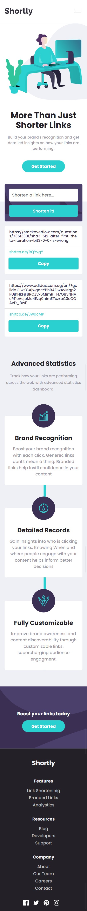

# Frontend Mentor - Shortly URL shortening API Challenge solution

This is a solution to the [Shortly URL shortening API Challenge challenge on Frontend Mentor](https://www.frontendmentor.io/challenges/url-shortening-api-landing-page-2ce3ob-G). Frontend Mentor challenges help you improve your coding skills by building realistic projects.

## Table of contents

- [Overview](#overview)
- [The challenge](#the-challenge)
- [Screenshot](#screenshot)
- [Links](#links)
- [Built with](#built-with)
- [Author](#author)
- [Acknowledgments](#acknowledgments)

**Note: Delete this note and update the table of contents based on what sections you keep.**

## Overview

The designs were created to the following widths: - Mobile: 375px - Desktop: 1440px

### The challenge

Users should be able to:

- View the optimal layout for the site depending on their device's screen size
- Shorten any valid URL
- See a list of their shortened links, even after refreshing the browser
- Copy the shortened link to their clipboard in a single click
- Receive an error message when the `form` is submitted if:
  - The `input` field is empty

### Screenshot

### Links

- Solution URL: [https://github.com/MonaElshikh/url-shortening]
- Live Site URL: [https://monaelshikh.github.io/url-shortening/]

### Built with

- Semantic HTML5 markup
- CSS custom properties
- Flexbox
- Typescript
- Api
- Mobile-first workflow

## Author

- Frontend Mentor - [@MonaElshikh](https://www.frontendmentor.io/profile/MonaElshikh)

## Acknowledgments

Thanks Frontendmentor for your support.
